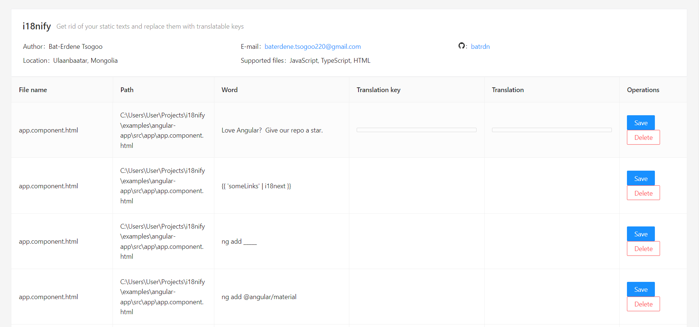

# i18nify

i18nify is a web application that finds static texts in a given software project directory and provides the feature to replace those static texts with translation keys.

## Prerequisites

1. You need [i18nify-backend](https://github.com/batrdn/i18nify-backend) project up and running.
2. `yarn` package manager
3. `Node.js`

## Environment variables

`PROJECT_PATH` - This is your project from which the static texts are extracted.

`OUTPUT_PATH` - where the generated translation keys are saved. Ideally, this should follow as: `%PROJECT_DIR%/translations/`, in which `translation-en.json` and `translation-mn.json` files should are created.

`FLASK_BACKEND_URL` - This is the path to [i18nify-backend](https://github.com/batrdn/i18nify-backend), which by default runs on `http://localhost:5000`

`NODE_BACKEND_URL` - Works with file system and directories, runs on `http://localhost:4000` by default.

`HTML_REPLACER_STRATEGY` - Whether the HTML replacement strategy follows Angular or plain HTML (Currently, only Angular is supported).

## How to run

1. Server - `yarn run server`. By running this command, it'll start the Node backend server and will extract static texts. Notice that, [i18nify-backend](https://github.com/batrdn/i18nify-backend) must be running prior to running this server.
2. Application - `yarn start`. Initializes the frontend application on `http://localhost:3000`.

  

